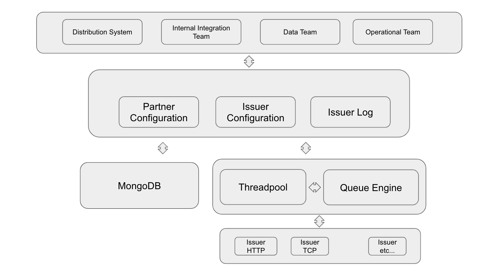

= Architecture (System Name)

== Related System

Teleco terdiri dari beberapa sistem yang saling terintegrasi. Berikut
daftar sistem yang terhubung.

|===
|*No* |*Nama Sistem* |*Deskripsi*
| 1 | Teleco Internal Dashboard untuk OPS User | Dashboard yang diperlukan untuk konfigurasi issuer {detil akan di update kembali}
| 2 | Distribution System API | API yang digunakan oleh sistem distribusi saat melakukan order {detil akan di update kembali}
|===

== High Level Architecture

==  ADR Document

The documents below are the history of all decisions applied by the development team based on the exploration

|===
|*Document Title* |*Remark/Explanation*
| <<adr-doc-teleco/0001-programming-language-teleco.adoc#, [ADR-0001] Programming Language Teleco >> |
| <<adr-doc-teleco/0002-database-teleco.adoc#, [ADR-0002] Database Teleco >> |
| <<adr-doc-teleco/0003-threadpool-teleco.adoc#, [ADR-0003] Threadpool Teleco >> |
| <<adr-doc-teleco/0004-queue-engine-teleco.adoc#, [ADR-0004] Queue Engine Teleco >> |
| <<adr-doc-teleco/0005-internal-authentication-teleco.adoc#, [ADR-0005] Internal Authentication Teleco >> |
| <<adr-doc-teleco/0006-system-integration-authentication-teleco.adoc#, [ADR-0006] System Integration Authentication Teleco >> |
|Next Decision | 
|===